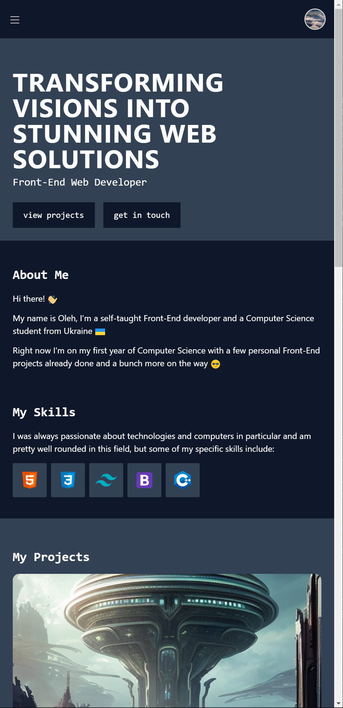

# Personal Portfolio

This is a repository of my personal portfolio page. It has come a long way from the very beginning of my programming journey, so feel free to check it out yourself

## Table of Contents

- [Personal Portfolio](#personal-portfolio)
  - [Table of Contents](#table-of-contents)
  - [Installation](#installation)
  - [Screenshots](#screenshots)
  - [Usage](#usage)
  - [Contributing](#contributing)
  - [License](#license)

## Installation

Instructions on how to install the project:

1. Clone the repository: `git clone https://github.com/seesmof/portfolio.git`
2. Install dependencies: `npm install`

## Screenshots

## Usage

This project is deployed using GitHub pages, and a link for it below

- [Live Preview](https://github.com/seesmof/portfolio)

## Contributing

Instructions on how to contribute to the project:

1. Fork the repository
2. Create a new branch: `git checkout -b feature-name`
3. Make changes and commit: `git commit -m "Add feature-name"`
4. Push to the branch: `git push origin feature-name`
5. Submit a pull request

## License

The project is licensed under the [MIT License](https://opensource.org/licenses/MIT).
